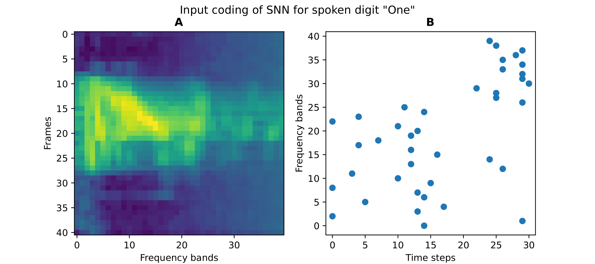

# Neuromorphic Computing Project

The aim of the project is to replicate the spoken digit classification SNN described by Dong et al. in Nengo.
This project is inspired by earlier done research by Dong et al., which showed high performance in two different situations (97.5\% and 93.8\% resp.).

Dong M, Huang X, Xu B (2018) Unsupervised speech recognition through spike-timing-dependent plasticity in a convolutional spiking neural network. PLoS ONE 13(11): e0204596. https://doi.org/10.1371/journal.pone.0204596

## Processing audio into spikes
The audio files are preprocessed by passing them through a MFSC filter making for 41 frames with 40 frequency bands per sample, resulting in e.g. figure 1A below. The spikes for each frame are computed by time-to-first-spike encoding for each frequency band in 30 time steps, i.e. a higher activity in a frequency band in a frame results in a spike at an earlier time step for that frequency band, see figure 1B.

Doing this for every frame, results in spike encodings as seen for three frames in figure 2.

Finally, concatenating all 41 frames in order for each sample, results in spike encodings of the spoken digits for all samples. Figure 3 shows three examples.

